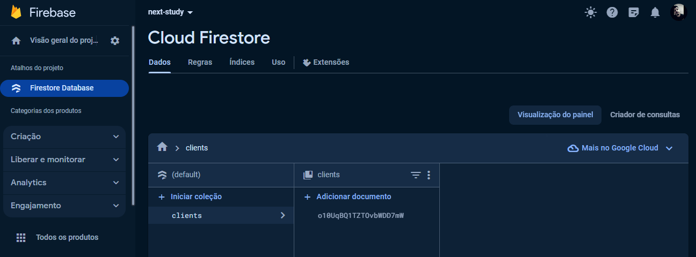
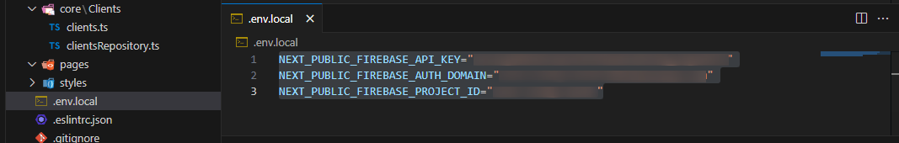

#[Cadastro de Usuários]() 

##Ferramentas utilizadas: 
NextJS / React
Typescript
TailwindCSS
React-Icons
[Firebase](https://firebase.google.com/?hl=pt) (integração com o banco de dados)

###Descrição do Projeto:
Neste projeto é possível realizar o cadastro (somente nome e idade) de usuários, realizar a alteração em caso de erro ou excluir.
Através do React foram criados os componentes que se adaptam dependendo da forma que você for trabalhar os dados.
Não foram feitas algumas validações pois não era o foco do projeto, então é possível digitar idades surreias (abaixo de 0 ou acima de 125 [pessoa com a maior idade já registrada faleceu aos 122 anos]).

####Observações:
Para fazer o projeto rodar na sua máquina é necessário criar uma coleção no Firebase chamada de '**clients**':

Também é necessário criar um arquivo *.env.local* na raiz do projeto com as seguintes variáveis (colocar a informação do seu Firebase, por questão de segurança esses arquivos não são exportados para o Git/ não devem ser compartilhados):

**NEXT_PUBLIC_FIREBASE_API_KEY**="*sua_apiKey_aqui*"
**NEXT_PUBLIC_FIREBASE_AUTH_DOMAIN**="*seu_authDomain_aqui*"
**NEXT_PUBLIC_FIREBASE_PROJECT_ID**="*seu_projectId_aqui*"